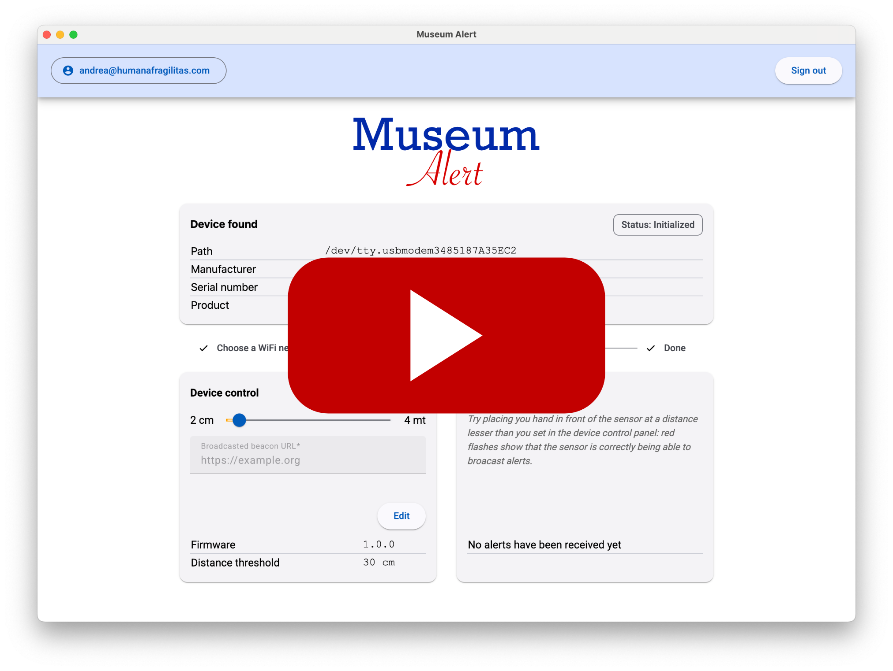

# Museum Alert Desktop

[](https://github.com/humana-fragilitas/museum-alert-desktop/actions/workflows/ci.yml)
[![License][license-badge]](LICENSE.md)

[![Linux Build][linux-build-badge]][linux-build]
[![MacOS Build][macos-build-badge]][macos-build]
[![Windows Build][windows-build-badge]][windows-build]

This repository contains cross-platform desktop application suitable for configuring and testing the "Museum Alert Sensor (MAS)", part of the ["Museum Alert"](https://github.com/humana-fragilitas/museum-alert) project.


## Prerequisites

This application depends on the infrastructure and artifacts created by ["Museum Alert API"](https://github.com/humana-fragilitas/museum-alert) AWS CDK project and the ["Museum Alert Sensor"](https://github.com/humana-fragilitas/museum-alert-sketch) device.

Users interested in using this project should build these dependencies first in the specified order.

## Getting Started

This project has two dependencies trees, following [Electron Builder two package.json structure](https://www.electron.build/tutorials/two-package-structure), respectively used by Electron renderer process and Electron main process:

``` bash
# Electron renderer process
npm install
```

``` bash
# Electron main process
cd app/
npm install
```

Why two package.json ? This project follow [Electron Builder two package.json structure](https://www.electron.build/tutorials/two-package-structure) in order to optimize final bundle and be still able to use Angular `ng add` feature.

## To build for development

- **in a terminal window** -> npm start

Voila! You can use your Angular + Electron app in a local development environment with hot reload!

The application code is managed by `app/main.ts`. In this sample, the app runs with a simple Angular App (http://localhost:4200), and an Electron window. \
The Angular component contains an example of Electron and NodeJS native lib import. \
You can disable "Developer Tools" by commenting `win.webContents.openDevTools();` in `app/main.ts`.

## Project structure

| Folder | Description                                      |
|--------|--------------------------------------------------|
| app    | Electron main process folder (NodeJS)            |
| src    | Electron renderer process folder (Web / Angular) |

## How to import 3rd party libraries

This sample project runs in both modes (web and electron). To make this work, **you have to import your dependencies the right way**. \

There are two kind of 3rd party libraries :
- NodeJS's one - Uses NodeJS core module (crypto, fs, util...)
    - I suggest you add this kind of 3rd party library in `dependencies` of both `app/package.json` and `package.json (root folder)` in order to make it work in both Electron's Main process (app folder) and Electron's Renderer process (src folder).

Please check `providers/electron.service.ts` to watch how conditional import of libraries has to be done when using NodeJS / 3rd party libraries in renderer context (i.e. Angular).

- Web's one (like bootstrap, material, tailwind...)
    - It have to be added in `dependencies` of `package.json  (root folder)`

## Add a dependency with ng-add

You may encounter some difficulties with `ng-add` because this project doesn't use the defaults `@angular-builders`. \
For example you can find [here](HOW_TO.md) how to install Angular-Material with `ng-add`.

## Browser mode

Maybe you only want to execute the application in the browser with hot reload? Just run `npm run ng:serve:web`.

## Included Commands

| Command                  | Description                                                                                           |
|--------------------------|-------------------------------------------------------------------------------------------------------|
| `npm run ng:serve`       | Execute the app in the web browser (DEV mode)                                                         |
| `npm run web:build`      | Build the app that can be used directly in the web browser. Your built files are in the /dist folder. |
| `npm run electron:local` | Builds your application and start electron locally                                                    |
| `npm run electron:build` | Builds your application and creates an app consumable based on your operating system                  |

**Your application is optimised. Only /dist folder and NodeJS dependencies are included in the final bundle.**

## You want to use a specific lib (like rxjs) in electron main thread ?

YES! You can do it! Just by importing your library in npm dependencies section of `app/package.json` with `npm install --save XXXXX`. \
It will be loaded by electron during build phase and added to your final bundle. \
Then use your library by importing it in `app/main.ts` file. Quite simple, isn't it?

## E2E Testing

E2E Test scripts can be found in `e2e` folder.

| Command       | Description               |
|---------------|---------------------------|
| `npm run e2e` | Execute end to end tests  |

Note: To make it work behind a proxy, you can add this proxy exception in your terminal  
`export {no_proxy,NO_PROXY}="127.0.0.1,localhost"`

## Debug with VsCode

[VsCode](https://code.visualstudio.com/) debug configuration is available! In order to use it, you need the extension [Debugger for Chrome](https://marketplace.visualstudio.com/items?itemName=msjsdiag.debugger-for-chrome).

Then set some breakpoints in your application's source code.

Finally from VsCode press **Ctrl+Shift+D** and select **Application Debug** and press **F5**.

Please note that Hot reload is only available in Renderer process.

[license-badge]: https://img.shields.io/badge/license-MIT-blue.svg
[license]: https://github.com/humana-fragilitas/museum-alert-desktop/blob/main/LICENSE.md

[linux-build-badge]: https://github.com/humana-fragilitas/museum-alert-desktop/actions/workflows/linux-build.yml/badge.svg
[linux-build]: https://github.com/humana-fragilitas/museum-alert-desktop/actions/workflows/linux-build.yml
[macos-build-badge]: https://github.com/humana-fragilitas/museum-alert-desktop/actions/workflows/macos-build.yml/badge.svg
[macos-build]: https://github.com/humana-fragilitas/museum-alert-desktop/actions/workflows/macos-build.yml
[windows-build-badge]: https://github.com/humana-fragilitas/museum-alert-desktop/actions/workflows/windows-build.yml/badge.svg
[windows-build]: https://github.com/humana-fragilitas/museum-alert-desktop/actions/workflows/windows-build.yml

